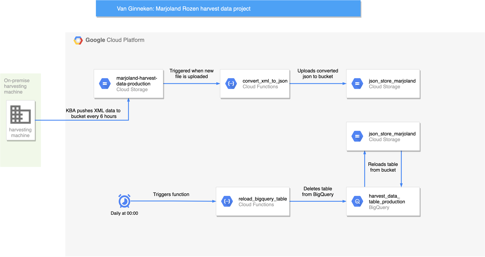

# marjoland-rozen

Data Warehouse solution built in GCP to store, process and analyze harvesting data from Marjoland Rozen's on premise
harvesting machine. This repository contains Cloud Functions code and Bash scripts to deploy the infrastructure from a
local development environment. 

## Structure

`/convert_xml_to_json`

Folder contains code for Cloud Function to convert XML files to JSON format.

`/reload_bigquery_table`

Folder contains code for Cloud Function that deletes and reloads BigQuery table.

`gcp_logger.py`

Module that implements structured logging in GCP. This module is shared by both `/convert_xml_to_json` and
`/reload_bigquery_table`.

`deploy_xml_to_json.sh`

Bash script that copies `gcp_logger.py` to `/convert_xml_to_json` in order to deploy to Cloud Functions. Variables:
    
    OUTPUT_BUCKET_NAME=json_store_marjoland

`reload_bigquery_table.sh`

Bash script that:

1) Deletes and re-creates PubSub topic
2) Copies `gcp_logger.py` to `/reload_bigquery_table`
3) Re-deploys Cloud Function
4) Deletes and re-creates Cloud Scheduler trigger
   
Variables:
    
    BIGQUERY_DATASET_NAME=harvest_dataset
    BIGQUERY_TABLE_NAME=harvest_data_table_production
    GCS_BUCKET_NAME=json_store_marjoland
    BQ_MAX_BAD_RECORDS=1000

## Development
Steps to follow to set up development environment:

0) Install the GCP CLI from https://cloud.google.com/sdk/docs/install
1) Make appropriate code changes
2) Run `deploy_xml_to_json.sh` and `reload_bigquery_table.sh` to re-deploy Cloud Functions.

## Contact information KBA
KBA Automatisering is the company that manages the on-premise harvesting system that generates the data.
They implemented the script that pushes the data to the GCS bucket. The contact person for this is Silvester van
Harberden. They can be reached through td@kba.nl or +31 (0) 297-250159.

## Architecture

 